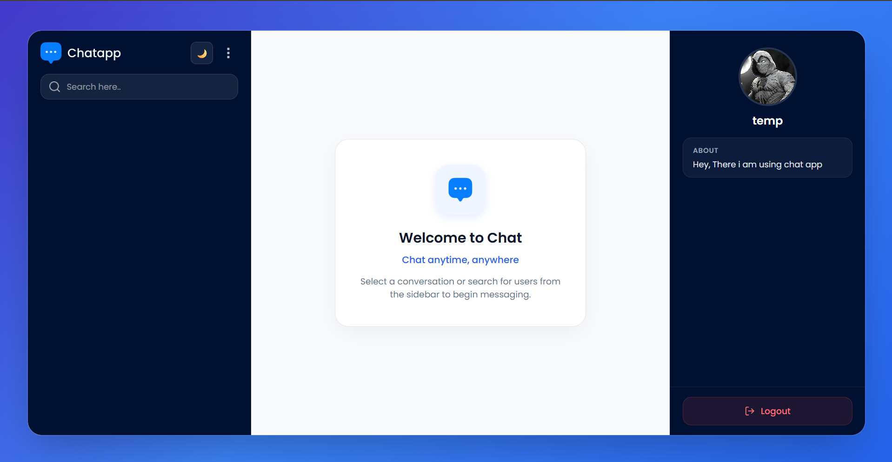
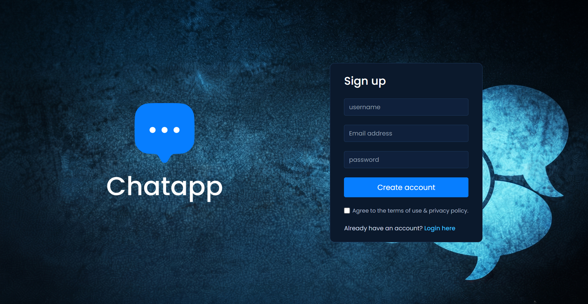
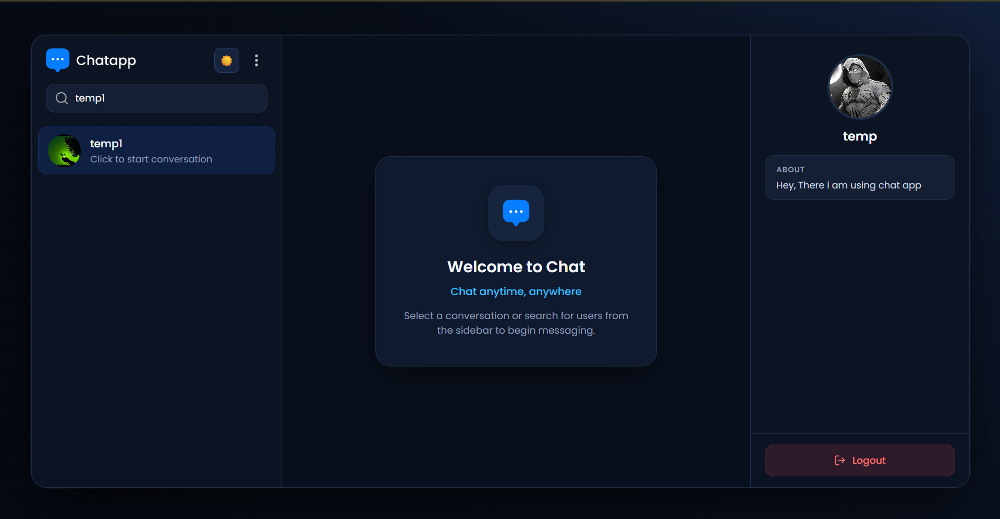
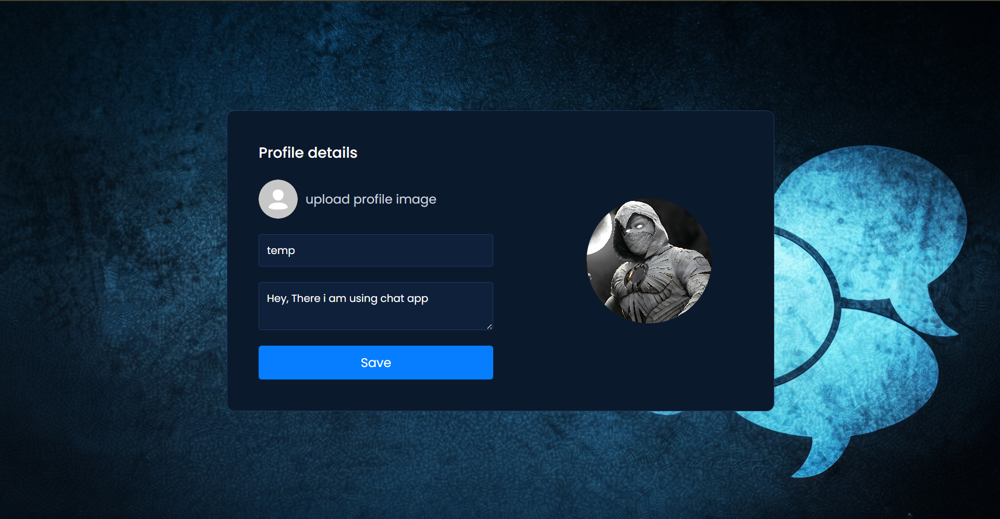
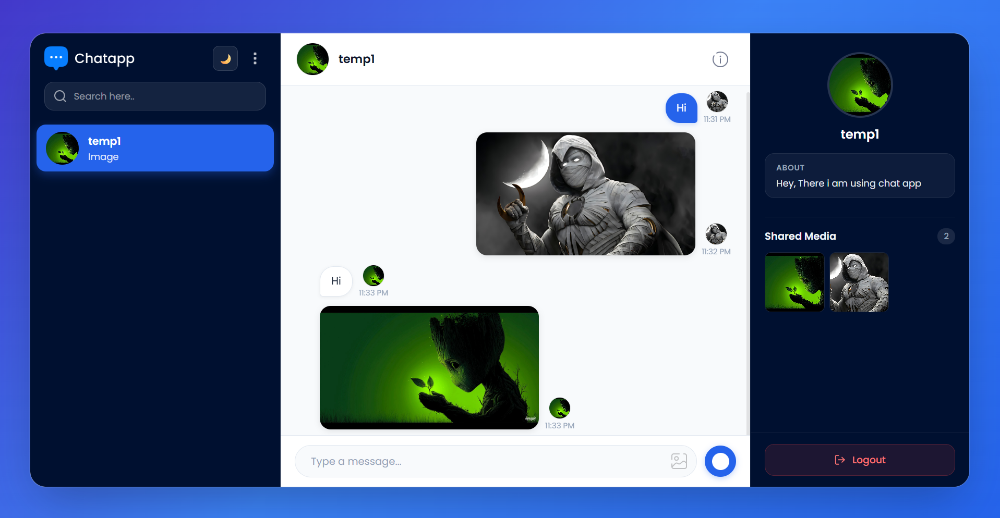

# 💬 Chat App

A modern **real-time one-to-one chat application** built using **React.js, Vite, Firebase, and Cloudinary**.

The application allows users to register and log in, create and manage their profiles, search for other users, start conversations, exchange real-time messages, share images, view typing indicators, and see online/offline status.

The frontend is developed using React.js and Vite, while Firebase provides authentication and real-time database functionality. Cloudinary is used for image uploads, and Firebase Hosting is used to deploy the application.

---

## 🚀 Live Demo

**Live Application:**  
https://chat-app-eb890.web.app

---

## ✨ Features

### 🔐 User Authentication

Users can:

- Create a new account
- Log in to an existing account
- Log out of the application
- Access chat functionality after authentication

Authentication is handled using **Firebase Authentication**.

---

### 👤 Profile Management

Users can:

- Set up their profile
- Update their profile information
- Upload a profile picture
- View profile information of other users

Profile images are uploaded using **Cloudinary**.

---

### 🔎 User Search

Users can search for other registered users and select a user to start a conversation.

This makes it possible to find users without manually entering their database information.

---

### 💬 Real-Time One-to-One Messaging

Users can communicate with another user through individual chat conversations.

Messages are stored in **Firebase Firestore** and are updated in real time.

When a new message is sent, the conversation updates without requiring a page refresh.

---

### ⚡ Real-Time Message Updates

The application uses Firestore real-time listeners to monitor message changes.

When a message is added or updated:

```text
User A
   │
   │ Sends message
   ▼
Firebase Firestore
   │
   │ Real-time update
   ▼
User B
   │
   ▼
Message appears automatically
```

---

### ⌨️ Typing Indicator

The application provides a real-time typing indicator.

When one user starts typing, the typing state is stored temporarily and the other user can see that the person is typing.

---

### 🟢 Online / Offline Status

The application displays the user's online/offline state so that users can understand whether another user is currently available.

---

### 📷 Image Sharing

Users can send images through chat.

The image upload process works through Cloudinary:

```text
User selects image
       │
       ▼
React Application
       │
       ▼
Cloudinary
       │
       ▼
Image URL
       │
       ▼
Firebase Firestore
       │
       ▼
Chat message
```

The actual image is hosted by Cloudinary, while the generated image URL is stored with the message data.

---

### 📱 Responsive Interface

The application provides a responsive chat interface designed to work across different screen sizes.

---

### ☁️ Firebase Hosting

The production application is deployed using **Firebase Hosting**.

---
## 📸 Screenshots

### 💬 Chat Interface



---

### 🔐 Authentication



---

### 🔎 User Search



---

### 👤 Profile Management



---

### 📷 Image Sharing



---

## 🛠️ Tech Stack

### Frontend

| Technology | Purpose |
|---|---|
| React.js | Building the user interface |
| Vite | Development server and production build tool |
| JavaScript | Application logic |
| HTML5 | Application structure |
| CSS3 | Styling and responsive interface |

### Backend & Cloud Services

| Technology | Purpose |
|---|---|
| Firebase Authentication | User registration and login |
| Firebase Firestore | Real-time database for users, chats, messages, and typing status |
| Cloudinary | Image and profile-picture uploads |
| Firebase Hosting | Hosting the production application |

### Development Tools

| Tool | Purpose |
|---|---|
| Git | Version control |
| GitHub | Source-code hosting |
| npm | Package management |
| Firebase CLI | Firebase configuration and deployment |
| Visual Studio Code | Development environment |

---

## 🏗️ Application Architecture

```text
                         ┌─────────────────┐
                         │      User       │
                         └────────┬────────┘
                                  │
                                  ▼
                         ┌─────────────────┐
                         │  React + Vite   │
                         │    Frontend     │
                         └────────┬────────┘
                                  │
                    ┌─────────────┼─────────────┐
                    │             │             │
                    ▼             ▼             ▼
             ┌────────────┐ ┌────────────┐ ┌────────────┐
             │  Firebase  │ │  Firestore │ │ Cloudinary │
             │    Auth    │ │  Database  │ │   Images   │
             └────────────┘ └────────────┘ └────────────┘
```

### Architecture Explanation

**React + Vite**

The frontend is responsible for:

- Displaying the chat interface
- Handling user interactions
- Managing application state
- Searching users
- Sending messages
- Receiving real-time updates
- Uploading images

**Firebase Authentication**

Responsible for:

- User registration
- User login
- Maintaining authentication state
- Identifying authenticated users

**Firebase Firestore**

Responsible for storing:

- User information
- Chat information
- Messages
- Typing status

**Cloudinary**

Responsible for:

- Profile image uploads
- Chat image uploads
- Providing hosted image URLs

**Firebase Hosting**

Responsible for serving the production React application on the web.

---

## 📂 Project Structure

```text
chat-app/
│
├── public/
│   ├── background.png
│   └── vite.svg
│
├── src/
│   │
│   ├── assets/
│   │   ├── add_icon.png
│   │   ├── arrow_icon.png
│   │   ├── avatar_icon.png
│   │   ├── gallery_icon.png
│   │   ├── green_dot.png
│   │   ├── help_icon.png
│   │   ├── logo.png
│   │   ├── logo_big.png
│   │   ├── logo_icon.png
│   │   ├── menu_icon.png
│   │   ├── search_icon.png
│   │   ├── send_button.png
│   │   └── ...
│   │
│   ├── components/
│   │   ├── ChatBox/
│   │   │   ├── ChatBox.jsx
│   │   │   └── ChatBox.css
│   │   │
│   │   ├── LeftSidebar/
│   │   │   ├── LeftSidebar.jsx
│   │   │   └── LeftSidebar.css
│   │   │
│   │   └── RightSidebar/
│   │       ├── RightSidebar.jsx
│   │       └── RightSidebar.css
│   │
│   ├── config/
│   │   └── firebase.js
│   │
│   ├── context/
│   │   └── AppContext.jsx
│   │
│   ├── lib/
│   │   └── upload.js
│   │
│   ├── pages/
│   │   ├── Chat/
│   │   │   ├── Chat.jsx
│   │   │   └── Chat.css
│   │   │
│   │   ├── Login/
│   │   │   ├── Login.jsx
│   │   │   └── Login.css
│   │   │
│   │   └── ProfileUpdate/
│   │       ├── ProfileUpdate.jsx
│   │       └── ProfileUpdate.css
│   │
│   ├── App.jsx
│   ├── index.css
│   └── main.jsx
│
├── .eslintrc.cjs
├── .firebaserc
├── .gitignore
├── firebase.json
├── firestore.rules
├── index.html
├── package.json
├── package-lock.json
├── vite.config.js
└── README.md
```

### 📁 Directory and File Explanation

| Directory / File | Purpose |
|---|---|
| `public/` | Contains publicly accessible static files |
| `src/assets/` | Contains application images, icons, logos, and other assets |
| `src/components/` | Contains reusable UI components |
| `src/components/ChatBox/` | Handles the main chat message interface |
| `src/components/LeftSidebar/` | Handles user search and chat/user navigation |
| `src/components/RightSidebar/` | Displays information related to the selected chat/user |
| `src/config/` | Contains Firebase configuration |
| `src/context/` | Contains global application state and Firebase-related logic |
| `src/lib/` | Contains reusable utility functions such as image uploading |
| `src/pages/Chat/` | Main chat page |
| `src/pages/Login/` | Login and registration interface |
| `src/pages/ProfileUpdate/` | Profile update interface |
| `App.jsx` | Main React application component |
| `main.jsx` | Entry point of the React application |
| `index.css` | Global application styles |
| `firebase.js` | Firebase project initialization and configuration |
| `upload.js` | Handles Cloudinary image uploads |
| `firestore.rules` | Defines Firestore database access rules |
| `firebase.json` | Firebase Hosting configuration |
| `.firebaserc` | Firebase project configuration and project alias |
| `vite.config.js` | Vite configuration |
| `package.json` | Project dependencies and npm scripts |
| `package-lock.json` | Locks installed dependency versions |
| `.gitignore` | Specifies files and folders that Git should ignore |
| `README.md` | Project documentation |

---

## ⚙️ How the Application Works

### 1. User Registration

A new user enters their registration details through the React interface.

```text
User
  │
  ▼
Registration Form
  │
  ▼
Firebase Authentication
  │
  ▼
Account Created
```

After successful registration, the application can identify the user through Firebase Authentication.

---

### 2. User Login

Existing users enter their credentials through the login page.

```text
User
  │
  ▼
Login Form
  │
  ▼
Firebase Authentication
  │
  ▼
Authenticated User
  │
  ▼
Chat Application
```

---

### 3. Profile Setup

After authentication, users can provide or update their profile information.

Profile images are uploaded to Cloudinary.

```text
Profile Image
      │
      ▼
Cloudinary
      │
      ▼
Image URL
      │
      ▼
User Profile Data
```

---

### 4. Searching for Users

The user can search for other registered users from the chat interface.

The application retrieves matching user information from Firestore and displays the available users.

---

### 5. Starting a Conversation

When a user selects another user:

```text
Current User
     │
     ▼
Select Another User
     │
     ▼
Chat / Conversation
     │
     ▼
Messages
```

The application creates or opens the corresponding conversation.

---

### 6. Sending a Message

When a user sends a text message:

```text
User types message
        │
        ▼
React ChatBox
        │
        ▼
Firebase Firestore
        │
        ▼
Message stored
        │
        ▼
Real-time listener
        │
        ▼
Message displayed
```

---

### 7. Sending an Image

When the user selects an image:

```text
Select Image
     │
     ▼
React Application
     │
     ▼
Cloudinary Upload
     │
     ▼
Secure Image URL
     │
     ▼
Firestore Message Data
     │
     ▼
Image displayed in Chat
```

---

### 8. Typing Indicator

When a user starts typing, the application updates the typing status.

```text
User starts typing
        │
        ▼
Typing status updated
        │
        ▼
Firestore
        │
        ▼
Other user receives update
        │
        ▼
"Typing..." indicator
```

---

### 9. Real-Time Updates

Firestore listeners allow the application to react to changes in the database.

This means users do not need to manually refresh the page to see newly received messages.

---

## 🗄️ Firestore Database Structure

The application uses the following top-level Firestore collections:

| Collection | Purpose |
|---|---|
| `users` | Stores registered user profile information |
| `chats` | Stores chat/conversation information |
| `messages` | Stores individual chat messages |
| `typing` | Stores temporary typing status information |

### `users`

Contains information related to registered users and their profiles.

Typical information can include:

- User ID
- User name
- Email
- Profile information
- Profile image URL

---

### `chats`

Stores information about conversations between users.

It is used to determine which users are connected through a conversation.

---

### `messages`

Stores individual messages belonging to conversations.

Messages can contain information such as:

- Sender
- Message content
- Timestamp
- Image URL when an image is shared

---

### `typing`

Stores temporary typing-state information.

This allows the application to display a typing indicator when another user is entering a message.

---

## 🔄 Application Data Flow

The overall data flow can be represented as:

```text
                         ┌───────────────┐
                         │     User      │
                         └───────┬───────┘
                                 │
                                 ▼
                         ┌───────────────┐
                         │ React + Vite  │
                         └───────┬───────┘
                                 │
             ┌───────────────────┼───────────────────┐
             │                   │                   │
             ▼                   ▼                   ▼
      ┌────────────┐      ┌────────────┐      ┌────────────┐
      │  Firebase  │      │  Firestore │      │ Cloudinary │
      │    Auth    │      │  Database  │      │   Images   │
      └────────────┘      └────────────┘      └────────────┘
             │                   │                   │
             │                   │                   │
             └───────────────────┼───────────────────┘
                                 │
                                 ▼
                         ┌───────────────┐
                         │ Chat Interface│
                         └───────────────┘
```

---

## 🚀 Getting Started

Follow the steps below to run the project locally.

### Prerequisites

Make sure the following are installed:

- Node.js
- npm
- Git
- Firebase CLI

You also need:

- A Firebase project
- A Cloudinary account
- A Cloudinary unsigned upload preset

---

### 1. Clone the Repository

```bash
git clone https://github.com/nalambeemasatyasai-dev/chat-app.git
cd chat-app
```

---

### 2. Install Dependencies

Install all required npm packages:

```bash
npm install
```

---

### 3. Configure Firebase

Open:

```text
src/config/firebase.js
```

Add your Firebase project configuration.

The configuration connects the React application to your Firebase project.

Do not commit private credentials or secrets to GitHub.

---

### 4. Configure Cloudinary

Open:

```text
src/lib/upload.js
```

Configure:

- Cloudinary Cloud Name
- Cloudinary Upload Preset

The project uses an **unsigned Cloudinary upload preset** for frontend image uploads.

Never place a Cloudinary API Secret in frontend code.

---

### 5. Run the Application

Start the Vite development server:

```bash
npm run dev
```

The terminal will display the local development URL.

Usually the application is available at:

```text
http://localhost:5173
```

---

## 🏗️ Production Build

Before deployment, create an optimized production build:

```bash
npm run build
```

Vite generates the production files inside:

```text
dist/
```

The `dist/` directory contains the optimized static files that are deployed to Firebase Hosting.

---

## ☁️ Firebase Hosting Deployment

The application is deployed using Firebase Hosting.

### Build the Application

```bash
npm run build
```

### Deploy to Firebase Hosting

```bash
firebase deploy --only hosting
```

After deployment, the application will be available through the Firebase Hosting URL.

### Live Application

https://chat-app-eb890.web.app

---

## 🔐 Security & Configuration

The project uses Firebase Authentication and Firestore security rules to control access to the application data.

### Firebase Authentication

Only authenticated users are allowed to access Firestore according to the current rules.

### Firestore Rules

The project contains:

```text
firestore.rules
```

These rules control read and write access to Firestore.

For production use, the rules should be further restricted so that users can only access the conversations and data they are authorized to access.

### Configuration Files

The following files contain project-specific configuration:

```text
src/config/firebase.js
src/lib/upload.js
```

These configuration files should be handled carefully when publishing the project.

### GitHub Safety

Never commit:

- Firebase private credentials
- Cloudinary API secrets
- Service account private keys
- `.env` files containing secrets
- Other private authentication credentials

The public repository should contain only the configuration required for users to understand and set up their own environment.

---

## 📦 Important npm Scripts

The project provides the following commonly used commands:

| Command | Purpose |
|---|---|
| `npm install` | Installs project dependencies |
| `npm run dev` | Starts the Vite development server |
| `npm run build` | Creates the production build |
| `npm run preview` | Previews the production build locally |

---

## 🌿 Git & GitHub Workflow

The project uses Git for version control and GitHub for source-code hosting.

Typical workflow:

```text
Make changes
     │
     ▼
Test application
     │
     ▼
git add
     │
     ▼
git commit
     │
     ▼
git push
     │
     ▼
GitHub Repository
```

Repository:

https://github.com/nalambeemasatyasai-dev/chat-app

---

## 🔮 Future Improvements

The project can be extended with additional functionality such as:

- 🔒 More granular Firestore security rules
- 🔔 Push notifications
- 🟢 Improved online/offline presence
- 🗑️ Message deletion
- ✏️ Message editing
- 😊 Emoji support
- 📎 Additional file-sharing options
- 🔍 Advanced message search
- 📱 Further mobile UI improvements
- ⚡ Code splitting and performance optimization
- 👥 Group conversations
- 🔔 Notification system
- 📌 Message timestamps and delivery status

---

## 🎯 Project Purpose

The purpose of this project is to demonstrate how a modern real-time communication application can be developed using a React frontend together with cloud-based services.

The project demonstrates practical implementation of:

- Component-based React development
- Vite-based frontend development
- Firebase Authentication
- Firebase Firestore
- Real-time database listeners
- React Context API
- Cloudinary image uploads
- Responsive UI development
- Firebase Hosting
- Git and GitHub

---

## 📚 What This Project Demonstrates

By studying this project, a developer can understand how different parts of a modern web application work together:

```text
React
  │
  ├── UI Components
  │
  ├── Pages
  │
  ├── Context / State
  │
  └── User Interactions
          │
          ▼
       Firebase
          │
          ├── Authentication
          │
          └── Firestore
                  │
                  ├── Users
                  ├── Chats
                  ├── Messages
                  └── Typing Status

       Cloudinary
          │
          └── Image Storage

       Firebase Hosting
          │
          └── Production Deployment
```

---

## 👨‍💻 Author

**Nalam Beema Satya Sai**

GitHub:

https://github.com/nalambeemasatyasai-dev

---

## 📄 License

This project is created for **educational and portfolio purposes**.
